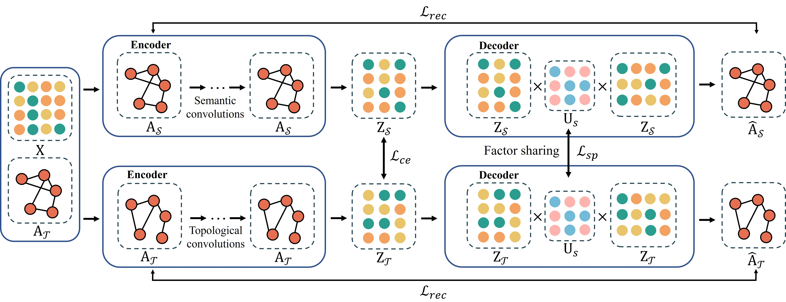

# Dual Low-Rank Graph AutoEncoder (DLR-GAE)

## Introduction
- This is an implement of DLR-GAE with PyTorch, which was run on a machine with AMD R9-5900HX CPU, RTX 3080 16G GPU and 32G RAM. It has been accepted by publication in AAAI 2023.

## Paper
Zhaoliang Chen, Zhihao Wu, Shiping Wang and Wenzhong Guo*, Dual Low-Rank Graph Autoencoder for Semantic and Topological Networks, Accepted by AAAI 2023.



## Requirements

- Torch: 1.10.0
- Torch-geometric: 2.0.2
- Numpy: 1.20.1
- Texttable: 1.6.4

## Quick Start
- Here are some commands for quick running of datasets used in this paper. 
    - For Citeseer dataset: 
    
      ```
      python main.py --dataset-name=citeseer --k=35 --alpha=0.5 --gamma=0.01
      ```
    
    - For BlogCatalog dataset: 
    
      ```
      python main.py --dataset-name=BlogCatalog --k=40 --alpha=0.6 --gamma=0.02 --feature-normalize=0
      ```
    
    - For CoraFull dataset:
    
      ```
      python main.py --dataset-name=CoraFull --k=45 --feature-normalize=0 --alpha=0.9 --gamma=0.01
      ```
    
    - For Flickr dataset:
    
      ```
      python main.py --dataset-name=Flickr --k=30 --alpha=0.8 --gamma=0.1 --feature-normalize=0
      ```
    
    - For UAI dataset:
    
      ```
      python main.py --dataset-name=UAI --k=20 --alpha=0.5 --gamma=0.01 --feature-normalize=0
      ```
    
    - For ACM dataset:
    
      ```
      python main.py --dataset-name=ACM --k=20 --alpha=0.4 --gamma=0.08 --feature-normalize=0
      ```
    
      

